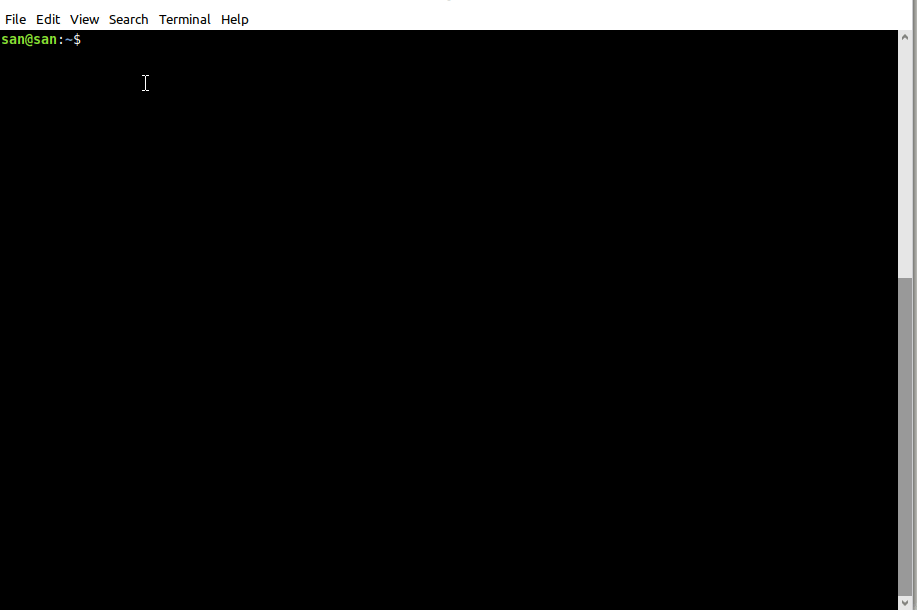
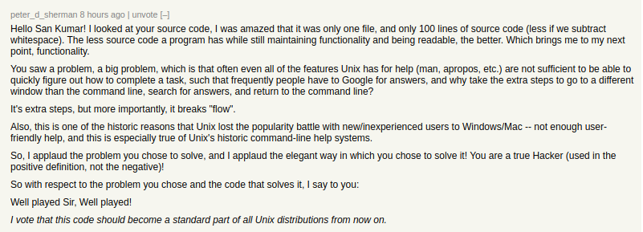

# howdoi

Get quick answers to common linux related questions, right inside your terminal by typing
"howdoi [your question]".

## Screenshot



## Examples

### Quick answer
````shell script
$ howdoi extract a bz2 file

  -j, --bzip2
            filter the archive through bzip2
  tar -xvjf enginsxt.tar.bz2
  
  Source: https://askubuntu.com/questions/707861/how-to-extract-tar-bz2
```` 

### Verbose output
````shell script
$ howdoi -v add a program to cron

  Put a shell script in one of these folders: /etc/cron.daily, /etc/cron.hourly, /etc/cron.monthly or /etc/cron.weekly. 
  
  If these are not enough for you, you can add more specific tasks e.g. twice a month or every 5 minutes. Go to the terminal and type:
  
  crontab -e
  
 ...snip
  
  Source: https://askubuntu.com/questions/2368/how-do-i-set-up-a-cron-job
````

### Multiple results
````shell script
$ howdoi -n 2 attach to a screen

 screen
 screen -S myprogramrunningunderscreen
 screen -ls

There are screens on:
    4964.myprogramrunningunderscreen    (05/31/2013 09:42:29 PM)    (Detached)
    4874.pts-1.creeper  (05/31/2013 09:39:12 PM)    (Detached)

Source: https://askubuntu.com/questions/302662/reattaching-to-an-existing-screen-session

  screen -d -r

Source: https://askubuntu.com/questions/302662/reattaching-to-an-existing-screen-session
````

### Other
````shell script
$ howdoi upgrade to latest php

  sudo apt-get upgrade
  sudo apt-get dist-upgrade
  sudo apt-add-repository ppa:ondrej/php
  sudo apt-add-repository ppa:ondrej/php5-oldstable
  sudo apt-add-repository ppa:ondrej/php5
  sudo apt-add-repository ppa:ondrej/php5-5.6
  sudo apt-get update
  sudo apt-get install php5.5
  sudo apt-get install php5.6
  sudo apt-get install php7.0
  do-release-upgrade
  
  Source: https://askubuntu.com/questions/565784/how-do-i-upgrade-php-version-to-the-latest-stable-released-version
```` 

## Usage
 
howdoi [-n -v -h -i] -- question

   	-n		Number of results (default is 1)
   	-v		Show full answer (otherwise shows only code)
   	-i		Interactive or REPL mode (useful for hotkey binding)
   	-h		Shows this help

## Installation

Just run the following commands (requires PHP 5+).

````shell script
$ mkdir -p ~/bin && wget https://raw.githubusercontent.com/san-kumar/howdoi/master/howdoi -O ~/bin/howdoi && chmod +x ~/bin/howdoi
$ sudo ln -s ~/bin/howdoi /usr/local/bin/howdoi

$ howdoi check my linux version
```` 

## Interactive or Popup mode

It is possible to run this outside the terminal interactively via a hotkey binding.

### Setup hotkey binding

- Copy [popup.sh](./popup.sh) in your `~/bin` folder (or the folder in which you've downloaded *howdoi* script)
- Run `chmod +x ~/bin/popup.sh`
- Go to *Settings &gt; Keyboard &gt; Shortcuts* and add a new shortcut to `~/bin/popup.sh`
- Assign a hotkey (e.g. Ctrl+Shift+H) to your new shortcut.
- Now press the hotkey and you should see a popup where you can type your question!"

## Caveats

Hopefully it will save you some time and makes your life easier. 
If so, please share it with your friends and give me [feedback here](https://news.ycombinator.com/item?id=23230157#23230181).
But remember:

- It's just a quick hack to save you a few clicks. I wrote this in less than 2 hours so don't expect this to be perfect.
- Right now, it prefers Ubuntu solutions over other linux distros.
- Just to clarify this only prints the answer, it does not run any code on your machine (the screenshot may have given a wrong impression to some people).

## Testimonials

Thank you everyone who encouraged me and voted for this project on Hacker news. Seeing comments like
these really makes the work that I've put into it worth it and now I want to make more such projects!

[](https://news.ycombinator.com/item?id=23230157)  
 	   	
## Licence   	

Perl's Artistic Licence